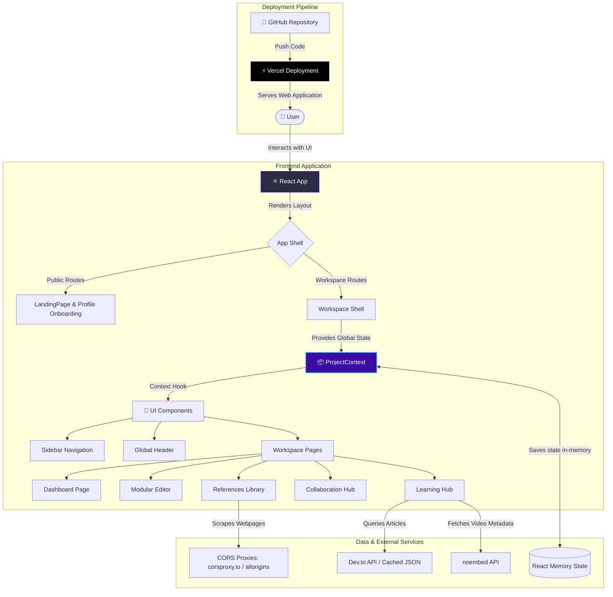

# 🔬 Research Flow — Research Paper Manager (RPM)

[](https://react.dev)
[](https://vite.dev)
[](https://reactrouter.com)
[](https://opensource.org/licenses/MIT)
[](https://vercel.com)

**Research Flow** is an intelligent, frontend-focused workspace engineered for researchers, students, and academic labs. It addresses the friction of scattered files, chaotic annotations, and untracked citations by consolidating writing, reference compiling, collaboration, and learning resources into a single, unified interface.

---

## 🌐 Live Demo

🚀 Experience the live platform here: **[[Live Demo on Vercel](https://research-paper-manager-demo.vercel.app)]** *(Replace with your actual deployment link)*

---


## ✨ Features & Functionalities

*   **👥 Smart User Onboarding:** Dynamic onboarding profile flow that tailors learning feeds and AI research recommendations to the user's explicit role and field of study.
*   **📊 Unified Research Dashboard:** At-a-glance analytics tracking active papers, team collaboration headcount, research hours, and project milestones alongside multi-attribute search and status filters.
*   **✍️ Modular Writing Editor:** Multi-section academic editor featuring a distraction-free **Focus Mode**, standard typographical controls (Bold, Italic, H1, H2), content-alignment toggles, live word-count calculations, and silent auto-saving.
*   **📚 Smart Reference Manager:** Citations library with three import pipelines:
    1.  *Cite Webpage:* Multi-proxy metadata client-side scraping (`corsproxy.io` & `allorigins.win`) extracting OpenGraph metadata.
    2.  *BibTeX Import:* Regex-based parsing to compile citations directly from bibliography code.
    3.  *Manual Entry:* Custom metadata fields for books, preprints, conferences, theses, and websites.
*   **📋 Live Bibliography Compiler:** Compiles entire libraries into formatted inline lists and copies them to the clipboard with a single click.
*   **🤝 Collaborative Simulator:** Interactive threaded discussion boards, team presence lists (online/offline indicators), and a chronological activity timeline to track revisions.
*   **🎓 Academic Learning Hub:** Video tutorial gallery with automatic YouTube metadata retrieval (via `noembed.com`) and a live Dev.to article reader with custom liquid tag parsers and inline Markdown rendering.
*   **💡 Dynamic AI Recommendations:** Tailors suggestion cards recommending relevant publications and methodology guides based on the user's designated field of study.

---

## 🛠️ Technical Architecture

Research Flow is built as a single-page application (SPA) leveraging **React 19** and **Vite** for optimized bundle sizes and hot module replacement (HMR).

### 1. Component-Based Architecture
The UI is modularized into reusable components located under `src/components/`. A global layout wrapper handles viewport responsiveness and provides structured sidebar and header areas.
*   **`Sidebar.jsx`**: Handles global routing navigation.
*   **`Header.jsx`**: Integrates search bars and profile cues.
*   **CSS Variable Styling**: Managed via `src/index.css` defining colors, fonts, margins, animations, and transitions as CSS variables for cohesive look-and-feel.

### 2. Global State Management (React Context)
A centralized **`ProjectContext.jsx`** manages global state, including:
*   `projects`: List of active papers, section counts, status, and metadata.
*   `references`: Database of bibliography elements.
*   `userProfile`: Personalization context (name, role, field of study).
*   `searchQuery`: Broad search queries matching inputs to cards.

Synchronous functions (`addProject`, `addReference`, `deleteReference`, `updateProjectTitle`) are exposed as a custom hook (`useProjects()`) to prevent prop drilling and keep widgets synchronized.

### 3. Client-Side SPA Routing
Navigation is structured utilizing **React Router v7** (`react-router-dom`).
*   **Public Paths (`/`, `/home`, `/profile`)**: Render the onboarding experience and features showcase.
*   **Workspace Paths (`/dashboard`, `/editor`, `/references`, etc.)**: Guarded under the `.app-layout` shell displaying the main navigation sidebar and header.
*   **Fallback Handling**: Catch-all routes redirect invalid URLs back to `/dashboard`.

### 4. Asset & Data Fetching Flows
*   **Dev.to API Syncing**: Dynamically queries tags matching the user's field. Includes an offline JSON backup (`real_blogs_cache.json`) for seamless performance during rate-limits.
*   **Web Scraper Proxy Pipeline**: Combats CORS limitations on the client side by chaining requests through `corsproxy.io` and `api.allorigins.win`, using a client-side `DOMParser` to extract details.
*   **noembed API Integration**: Contacts YouTube JSON services to fetch channel titles and high-quality thumbnails for tutorials dynamically.

---

## 📐 Architecture Diagram

Below is the conceptual architecture flow showing user interactions, state management, external integrations, and the Vercel deployment pipeline:



---

## 📁 Folder Structure

```text
RPM/
├── public/                 # Static assets and browser icons
├── src/
│   ├── assets/             # Images and local binary vector art
│   ├── components/         # Reusable structural widgets
│   │   ├── Header.css      # Styling for top header bar
│   │   ├── Header.jsx      # Top header bar (actions, profile summary)
│   │   ├── Sidebar.css     # Styling for sidebar
│   │   ├── Sidebar.jsx     # Navigation sidebar with navigation list
│   │   ├── PlaceholderPage.css
│   │   └── PlaceholderPage.jsx
│   ├── context/
│   │   └── ProjectContext.jsx # Global project, reference, and profile state
│   ├── data/
│   │   └── real_blogs_cache.json # Offline cache backup for learning hub articles
│   ├── pages/              # Primary router view pages
│   │   ├── Collaboration.css/.jsx  # Collaboration simulator and activity log
│   │   ├── Dashboard.css/.jsx      # Core analytics dashboard & project cards
│   │   ├── Editor.css/.jsx         # Multi-section editor with Focus mode
│   │   ├── LandingPage.css/.jsx    # Public marketing layout & developer footer
│   │   ├── LearningHub.css/.jsx    # Online/offline blogs & video embedding hub
│   │   ├── MyPapers.css/.jsx       # Detailed paper lists and status managers
│   │   ├── Profile.css/.jsx        # Profile onboarding and personalized fields
│   │   └── Recommendations.css/.jsx# AI recommending pipeline matching study fields
│   ├── App.css
│   ├── App.jsx             # Declares routing logic & context providers
│   ├── index.css           # Styling theme system (color tokens, font hierarchies)
│   └── main.jsx            # Entry mount point
├── eslint.config.js        # Lint settings
├── index.html              # HTML shell template
├── package.json            # Scripts, dependency manifests
└── vite.config.js          # Vite configurations
```

---

## 💻 Tech Stack

| Technology | Category | Purpose |
| --- | --- | --- |
| **React 19** | Core Library | Structural component tree, hooks, and reactive UI updating. |
| **Vite** | Bundler & Server | Serves files locally with rapid HMR and builds compiled code. |
| **React Router v7** | Navigation Router | Orchestrates route-switches and viewport rendering. |
| **Lucide React** | Icon Pack | Renders high-quality modern icons for navigation and actions. |
| **Vanilla CSS** | Styling | Styling variables, layout grids, animations, and custom scrollbars. |
| **Dev.to API** | External API | Queries live academic posts dynamically based on field tags. |
| **noembed API** | External API | Automatically extracts YouTube channel names and thumbnail images. |

---

## 🚀 Installation & Setup

Follow these steps to set up the project locally on your machine:

1.  **Clone the Repository**
    ```bash
    git clone https://github.com/SaniyaBijlani/Research_Paper_Manager.git
    cd Research_Paper_Manager
    ```

2.  **Install Dependencies**
    ```bash
    npm install
    ```

3.  **Start the Development Server**
    ```bash
    npm run dev
    ```
    *Open the URL shown in your terminal (typically `http://localhost:5173`) in your browser.*

4.  **Lint Codebase**
    ```bash
    npm run lint
    ```

5.  **Build for Production**
    ```bash
    npm run build
    ```

---

## 📜 Available Scripts

In the project directory, you can run the following scripts:

| Script | Command | Description |
| --- | --- | --- |
| `npm run dev` | `vite` | Runs the app in development mode with HMR. |
| `npm run build` | `vite build` | Compiles the production bundle into the `dist/` folder. |
| `npm run lint` | `eslint .` | Runs ESLint to check for code issues and syntax errors. |
| `npm run preview`| `vite preview` | Previews the compiled production build locally. |

---

## 🔐 Environment Variables

The project operates entirely client-side and does not require private backend API tokens. If you wish to configure a custom proxy or external database, you can create a `.env` file at the root:

```env
# Example configuration for customized proxies (Optional)
VITE_METADATA_PROXY_URL=https://your-custom-proxy.herokuapp.com/
```

---


## 🔮 Future Improvements & Roadmap

- [ ] **Database Persistence:** Integrate Firebase or Supabase to persist user profiles, projects, and references securely.
- [ ] **AI-Powered Section Outlining:** Implement LLM support to generate templates and structure proposals based on selected research keywords.
- [ ] **Real-time Live Collaboration:** Transition the current collaboration simulation into a live WebSockets-based text collaboration suite.
- [ ] **Automated PDF Parsing:** Allow users to upload PDFs and parse title, authors, abstracts, and DOIs directly using AI-backed extraction tools.
- [ ] **BibTeX Export File Generator:** Create and download `.bib` configuration sheets containing the complete reference library database.

---

## 💡 Challenges Faced & Learnings

*   **Handling CORS on Client-Side Scraping:** Retrieving OpenGraph details directly from third-party links fails in standard React apps due to browser CORS policies. Chaining fallback proxies (`corsproxy.io` & `allorigins.win`) solved this, ensuring reliable webpage citations.
*   **Custom Markdown Parsing:** Handling nested Liquid syntax and HTML layouts returned from dev.to was tricky. Implementing a custom line-by-line block parser taught me code safety when loading external HTML strings inside React.
*   **Pure Vanilla CSS Framework:** Designing a polished UI/UX matching modern standards without utility frameworks (Tailwind) required structured design tokens. Managing typography, spacing variables, layouts, and interactive micro-animations using custom CSS properties resulted in modular, manageable code.

---

## 🤝 Acknowledgements


*   **Lucide Icons**: For providing crisp, lightweight vector graphics.
*   **noembed & Dev.to**: For offering open-access APIs to source learning guides and video data.

---

## ✍️ Author

**Saniya Bijlani**
*   🎓 Student at **Thadomal Shahani Engineering College**
*   💼 Connect on LinkedIn: [saniyabijlani6](https://www.linkedin.com/in/saniyabijlani6)
*   📸 Follow on Instagram: [@saniyaspace_](https://www.instagram.com/saniyaspace_?igsh=MWEwbTBsODF0NXdweQ==)

---

## 📄 License

This project is licensed under the MIT License - see the [LICENSE](LICENSE) file for details.
